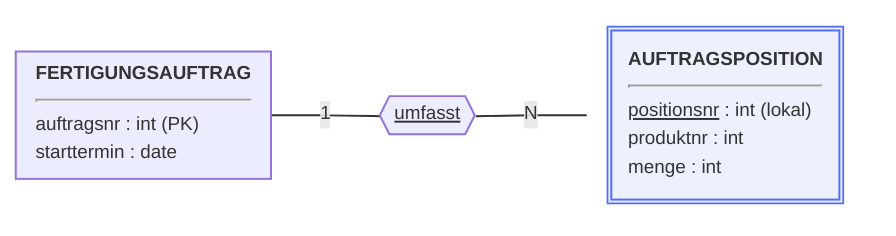
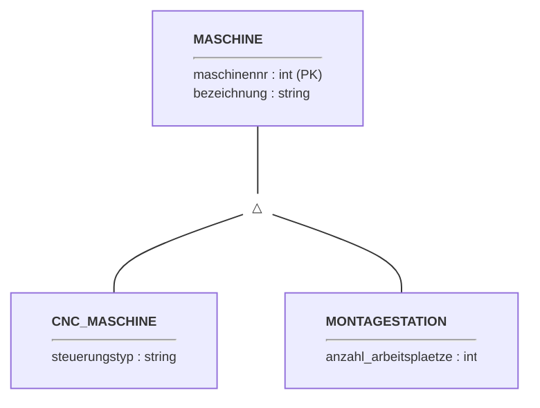

# Woche 6: Transformation der erweiterten ER-Konzepte

> Zeitbedarf: ca. 1,5 Stunden.

## Worum geht es?

In den letzten beiden Wochen hast du gelernt, wie einfache Entity-Typen
und die vier "normalen" Beziehungstypen (N:M, 1:N, 1:1, rekursiv) in
das Relationenmodell überführt werden. Aus Woche 3 kennst du aber noch
zwei Erweiterungen des ER-Modells, für die das bisher noch fehlt:
**abhängige Entity-Typen** und **Spezialisierung**. Diese Woche
schließt genau diese Lücke — mit zwei weiteren, ebenfalls
regelbasierten Transformationsschritten.

Außerdem lernst du eine wichtige Grenze des Relationenmodells kennen:
Nicht jede Information, die im ER-Diagramm steckt, lässt sich beim
Transformieren vollständig erhalten. Zum Abschluss bekommst du noch
eine empfohlene Reihenfolge an die Hand, mit der du bei einem
kompletten ER-Diagramm systematisch vorgehen kannst.

## Das solltest du danach können

- Du kannst erklären, warum sich der Primärschlüssel der Relation eines
  abhängigen Entity-Typs aus zwei Teilen zusammensetzt, statt einfach
  nur aus dem lokalen Schlüsselattribut zu bestehen.
- Du kannst eine Spezialisierung mit Supertyp und mehreren Subtypen in
  mehrere Relationen überführen und weißt, warum der übernommene
  Supertyp-Schlüssel in der Subtyp-Relation gleichzeitig Fremd- und
  Primärschlüssel ist.
- Du kannst an einem eigenen Beispiel erklären, warum eine
  Mindestteilnahme aus dem ER-Diagramm (z. B. "jeder X muss mindestens
  einen Y haben") im Relationenmodell nicht immer sichergestellt werden
  kann.
- Du kennst die empfohlene Reihenfolge, in der die Elemente eines
  vollständigen ER-Diagramms transformiert werden sollten.

## Erarbeitung

Lies im Lehrbrief (`Lehrbrief_relationaleDatenbanken.pdf`) die folgenden
Abschnitte der Reihe nach. Mach dir wie in den letzten Wochen Notizen in
eigenen Worten — die brauchst du für die Aufgabe unten.

**Schritt 1:** Abschnitt 5.3, Einleitung sowie 5.3.1 "Abhängige
Entity-Typen" (S. 45-46): Regel 5 (Abbildung abhängiger Entity-Typen).

**Schritt 2:** Abschnitt 5.3.2 "Spezialisierung/Generalisierung"
(S. 47-48): Regel 6 (Abbildung von Spezialisierungshierarchien).

**Schritt 3:** Abschnitt 5.4 "Erhaltung der Informationskapazität"
(S. 48): warum Untergrenzen aus dem ER-Diagramm bei der Transformation
verloren gehen können.

**Schritt 4:** Abschnitt 5.5 "Vorgehen bei der Schema-Transformation"
(S. 49): die empfohlene Reihenfolge für vollständige ER-Diagramme.

Lies **nicht** weiter in Abschnitt 5.6 ("Normalformen") — das ist Thema
der nächsten Woche.

## Aufgabe

Zwei kleine, voneinander unabhängige Transformationen — beide
Anwendungswelten kennst du bereits aus Woche 3.

**Teil A — Abhängiger Entity-Typ**

`FERTIGUNGSAUFTRAG` (Schlüssel `auftragsnr`, dazu `starttermin`) und der
davon abhängige Entity-Typ `AUFTRAGSPOSITION` (lokales Attribut
`positionsnr`, das nur innerhalb eines Auftrags eindeutig ist, dazu
`produktnr` und `menge`) sind über die identifizierende Beziehung
`umfasst` verbunden (1 `FERTIGUNGSAUFTRAG` : N `AUFTRAGSPOSITION`):

- Transformiere `FERTIGUNGSAUFTRAG` (einfacher Entity-Typ, Regel 1) und
  `AUFTRAGSPOSITION` (abhängiger Entity-Typ, Regel 5) jeweils in ein
  Relationenschema. Kennzeichne bei `AUFTRAGSPOSITION`, aus welchen
  Attributen sich der Primärschlüssel zusammensetzt.

??? tip "Musterlösung anzeigen"
    **Teil A — `AUFTRAGSPOSITION` nach Regel 5**

    `FERTIGUNGSAUFTRAG` wird nach Regel 1 ganz normal transformiert.
    `AUFTRAGSPOSITION` verschmilzt nach Regel 5 mit der identifizierenden
    Beziehung `umfasst`; da `AUFTRAGSPOSITION` keinen eigenen Schlüssel
    besitzt, setzt sich der Primärschlüssel aus dem lokalen Attribut
    `positionsnr` **und** dem Fremdschlüssel `auftragsnr` zusammen.

    | Schlüssel | Attribut | Wertebereich | optional? |
    |---|---|---|---|
    | PK | auftragsnr | int | nein |
    | – | starttermin | date | nein |

    | Schlüssel | Attribut | Wertebereich | optional? |
    |---|---|---|---|
    | PK, FK | auftragsnr | int | nein |
    | PK | positionsnr | int | nein |
    | – | produktnr | int | nein |
    | – | menge | int | nein |

    `positionsnr` allein würde nicht genügen, da diese Nummer nur
    *innerhalb* eines Auftrags eindeutig ist (Auftrag 4711 und Auftrag
    4712 können beide eine Position 1 haben). Erst die Kombination aus
    `auftragsnr` (Fremdschlüssel zum identifizierenden
    `FERTIGUNGSAUFTRAG`) und `positionsnr` identifiziert jeden Datensatz
    eindeutig.

**Teil B — Spezialisierung**

`MASCHINE` (Supertyp, Schlüssel `maschinennr`, dazu `bezeichnung`) hat
zwei Subtypen: `CNC_MASCHINE` (zusätzliches Attribut `steuerungstyp`)
und `MONTAGESTATION` (zusätzliches Attribut `anzahl_arbeitsplaetze`):

- Transformiere diese Spezialisierung nach Regel 6 in drei
  Relationenschemata. Kennzeichne in den beiden Subtyp-Relationen, wo
  der übernommene Schlüssel gleichzeitig Fremd- und Primärschlüssel
  ist.

??? tip "Musterlösung anzeigen"
    **Teil B — Spezialisierung `MASCHINE` nach Regel 6**

    Für Supertyp und beide Subtypen entsteht je eine eigene Relation;
    beide Subtyp-Relationen erhalten `maschinennr` als Fremdschlüssel,
    der gleichzeitig ihr eigener Primärschlüssel ist.

    | Schlüssel | Attribut | Wertebereich | optional? |
    |---|---|---|---|
    | PK | maschinennr | int | nein |
    | – | bezeichnung | string | nein |

    | Schlüssel | Attribut | Wertebereich | optional? |
    |---|---|---|---|
    | PK, FK | maschinennr | int | nein |
    | – | steuerungstyp | string | nein |

    | Schlüssel | Attribut | Wertebereich | optional? |
    |---|---|---|---|
    | PK, FK | maschinennr | int | nein |
    | – | anzahl_arbeitsplaetze | int | nein |

    Da `maschinennr` in beiden Subtyp-Relationen gleichzeitig
    Primärschlüssel ist, kann jede Maschine höchstens einmal als
    `CNC_MASCHINE` und höchstens einmal als `MONTAGESTATION` auftauchen
    — sie kann aber auch in keiner der beiden Relationen vorkommen
    (z. B. eine Maschine, die weder CNC-Maschine noch Montagestation
    ist) oder theoretisch in beiden, falls das fachlich Sinn ergibt.

## Selbstkontrolle

### Frage 1

Erkläre, warum sich der Primärschlüssel der Relation, die aus einem
abhängigen Entity-Typ entsteht, aus zwei Teilen zusammensetzt, und was
passieren würde, wenn man nur das lokale Attribut als Primärschlüssel
verwenden würde.

??? question "Antwort anzeigen"
    Das lokale Attribut (z. B. `positionsnr`) identifiziert einen
    Datensatz nur *innerhalb* seines identifizierenden Entity-Typs
    eindeutig, nicht aber über alle Datensätze der gesamten Relation
    hinweg — verschiedene Fertigungsaufträge können durchaus jeweils
    eine Position 1 haben. Würde man nur das lokale Attribut als
    Primärschlüssel verwenden, könnten zwei Datensätze mit demselben
    lokalen Wert (aber unterschiedlichem identifizierenden Datensatz)
    nicht mehr unterschieden werden — die Entity-/Schlüsselintegrität
    wäre verletzt. Erst die Kombination aus dem lokalen Attribut und
    dem Fremdschlüssel zum identifizierenden Entity-Typ macht jeden
    Datensatz eindeutig: In `AUFTRAGSPOSITION` ist dieser Fremdschlüssel
    konkret das Attribut `auftragsnr`, das auf den zugehörigen Datensatz
    in `FERTIGUNGSAUFTRAG` verweist — erst die Kombination aus
    `auftragsnr` und `positionsnr` identifiziert eine Auftragsposition
    eindeutig.

### Frage 2

<quiz>
Die folgenden vier Satzanfänge beschreiben Regeln und Grenzen der Schema-Transformation. Vervollständige jeden Satzanfang mit der passenden Fortsetzung:

1. Der Primärschlüssel der Relation eines abhängigen Entity-Typs setzt sich zusammen aus
2. Bei einer Spezialisierung erhält jede Subtyp-Relation den Primärschlüssel der Supertyp-Relation als
3. Im Relationenmodell lässt sich die Untergrenze "jeder Supertyp-Datensatz muss mindestens einem Subtyp angehören" grundsätzlich
4. Bei der empfohlenen Reihenfolge der Schema-Transformation werden Spezialisierungshierarchien

Ordne jedem Satzanfang die passende Fortsetzung zu:

- [[3]] nicht ausdrücken — das Relationenmodell kennt keinen Mechanismus, der eine solche Mindestteilnahme erzwingt.
- [[1]] dem lokalen Schlüsselattribut und dem Fremdschlüssel des identifizierenden Entity-Typs.
- [[4]] vor den abhängigen Entity-Typen und vor allen Beziehungstypen transformiert.
- [[2]] Fremdschlüssel, der gleichzeitig auch der Primärschlüssel der Subtyp-Relation ist.

---
Abschnitte 5.3 bis 5.5 im Lehrbrief (S. 45-49) behandeln alle vier Aussagen der Reihe nach.
</quiz>

### Frage 3

Nenne ein eigenes Beispiel (nicht das Studiengang/Modul-Beispiel aus
dem Lehrbrief) für eine Untergrenze aus einem ER-Diagramm, die bei der
Transformation ins Relationenmodell nicht mehr sichergestellt werden
kann.

??? question "Antwort anzeigen"
    Ein mögliches Beispiel: Im ER-Diagramm könnte gefordert sein, dass
    jede `MASCHINE` mindestens einen `WARTUNGSAUFTRAG` haben muss
    (Untergrenze 1 aus Sicht der Maschine). Nach der Transformation
    (Regel 3, Woche 5) lässt sich zwar sicherstellen, dass jeder
    Wartungsauftrag zu einer existierenden Maschine gehört
    (Fremdschlüsselintegrität) — aber nicht, dass zu jeder Maschine
    auch mindestens ein Wartungsauftrag existiert. Eine fabrikneue
    Maschine ganz ohne Wartungsauftrag wäre im Relationenmodell also
    problemlos möglich, obwohl das ER-Diagramm das eigentlich
    ausschließt. Andere sinnvolle Beispiele sind ebenso denkbar, solange
    sie eine Mindestteilnahme auf der "Fremdschlüssel-losen" Seite einer
    Beziehung fordern.

### Frage 4

<quiz>
Welche Aussagen zur Transformation der erweiterten ER-Konzepte sind korrekt? (Mehrfachauswahl möglich)

- [x] Innerhalb einer Subtyp-Relation kann laut Regel 6 pro Supertyp-Datensatz höchstens ein zugehöriger Subtyp-Datensatz existieren.
- [ ] Bei einer Spezialisierung entsteht insgesamt nur eine einzige Relation, die Supertyp und alle Subtypen gemeinsam enthält.
  > Falsch: Für den Supertyp und für jeden Subtyp entsteht jeweils eine eigene Relation.
- [x] Bei einem abhängigen Entity-Typ setzt sich der Primärschlüssel der entstehenden Relation aus einem lokalen Attribut und einem Fremdschlüssel zusammen.
- [ ] Die im ER-Diagramm definierten Untergrenzen (z. B. "mindestens ein...") bleiben bei der Transformation immer vollständig erhalten.
  > Falsch: Genau das ist die Einschränkung aus Abschnitt 5.4 — Untergrenzen lassen sich im Relationenmodell nicht in jedem Fall ausdrücken, die Informationskapazität geht dabei teilweise verloren.
</quiz>

### Frage 5

<quiz>
Welche Aussage zur Relation `FERTIGUNGSAUFTRAG` — dem identifizierenden Entity-Typ von `AUFTRAGSPOSITION` — ist korrekt?

- [ ] `FERTIGUNGSAUFTRAG` bekommt durch die abhängige Beziehung zusätzlich ein Fremdschlüsselattribut, das auf `AUFTRAGSPOSITION` verweist.
- [x] `FERTIGUNGSAUFTRAG` wird ganz normal nach Regel 1 transformiert — dass `AUFTRAGSPOSITION` von ihr abhängt, ändert daran nichts.
- [ ] `FERTIGUNGSAUFTRAG` kann nicht für sich allein transformiert werden, weil sie Teil einer abhängigen Beziehung ist.
</quiz>
