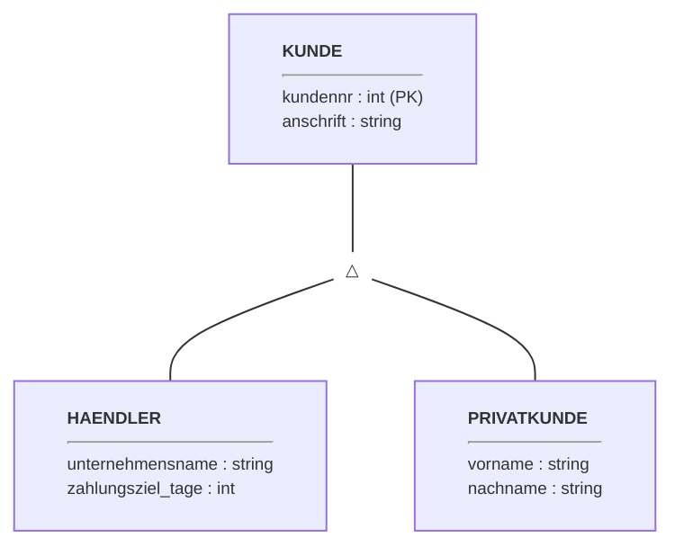
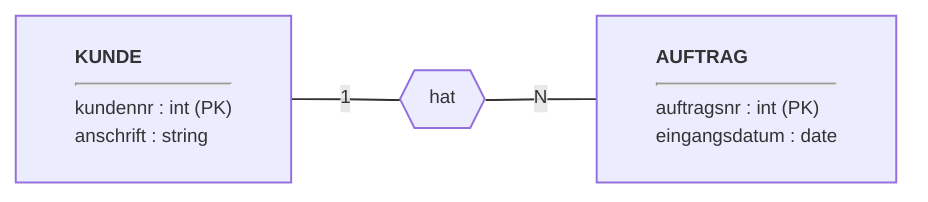
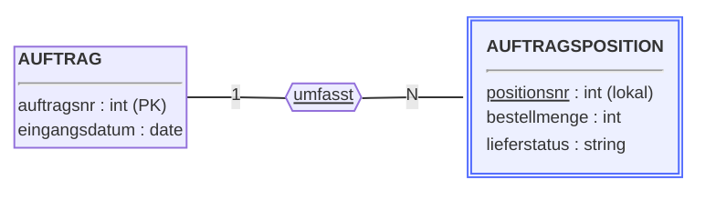
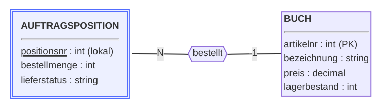
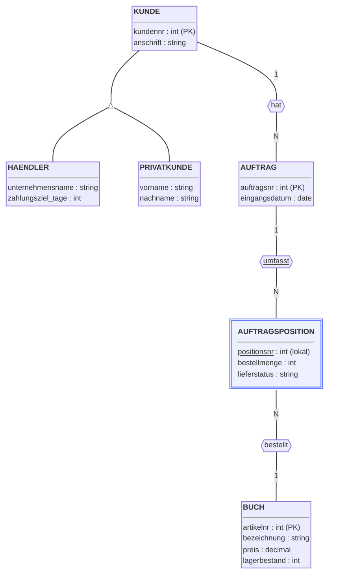
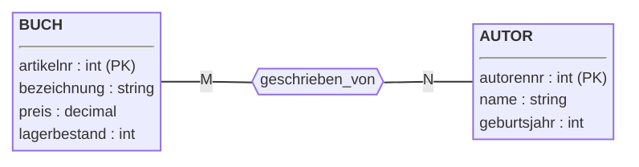
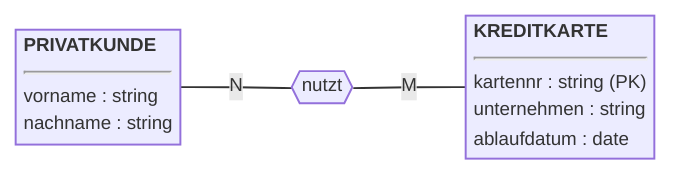
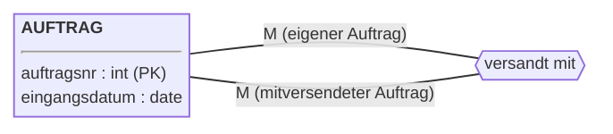
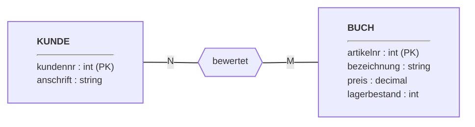
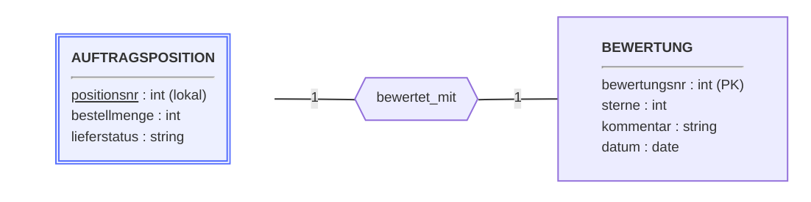

# ER-Modell aufstellen (20.10.2026)

---

## Übung: ER-Modell aufstellen

### Worum geht es?

Ihr habt in der Praxisphase (Woche 2 und 3) bereits alle Bausteine des
ER-Modells kennengelernt: Entity-Typen, Attribute, Beziehungstypen,
Kardinalitäten, abhängige Entity-Typen und Spezialisierung — am
Beispiel FH-Info sowie an eigenen Szenarien aus eurem Praxisumfeld.
Heute wendet ihr dieses Werkzeug zum ersten Mal live gemeinsam auf ein
komplett neues Beispiel an, das ihr noch nicht kennt.

!!! abstract "Lernziele"
    - Ihr könnt nachvollziehen, wie aus einer Textbeschreibung Schritt
      für Schritt ein vollständiges ER-Modell mit Spezialisierung,
      abhängigem Entity-Typ und mehreren Beziehungstypen entsteht.
    - Ihr könnt erklären, warum bestimmte Attribute oder Beziehungen an
      einem Subtyp und nicht am Supertyp hängen.

### Kurzer Rückblick (ca. 5 Min.)

**1. Wozu dient ein ER-Diagramm eigentlich?**

<!-- MUSTERLOESUNG-START -->
??? tip "Antwort anzeigen"
    Es ist das zentrale Werkzeug des konzeptuellen Datenbankentwurfs —
    ein grafisches, technikfernes Modell, mit dem man sich mit
    Anwender:innen über die relevanten Daten einer Anwendungswelt
    verständigen kann, bevor man sich um die technische Umsetzung
    (Tabellen, SQL) kümmert.
<!-- MUSTERLOESUNG-ENDE -->

**2. Was macht einen Entity-Typ zu einem abhängigen Entity-Typ?**

<!-- MUSTERLOESUNG-START -->
??? tip "Antwort anzeigen"
    Er hat keinen eigenen Schlüssel und ist in seiner Existenz von
    einem anderen ("identifizierenden") Entity-Typ abhängig — erst die
    Kombination aus einem lokalen Attribut und der Beziehung zum
    identifizierenden Entity-Typ macht ihn eindeutig identifizierbar.
<!-- MUSTERLOESUNG-ENDE -->

**3. Was "erbt" ein Subtyp von seinem Supertyp?**

<!-- MUSTERLOESUNG-START -->
??? tip "Antwort anzeigen"
    Alle Attribute und Beziehungen des Supertyps, zusätzlich zu seinen
    eigenen.
<!-- MUSTERLOESUNG-ENDE -->

### Das Szenario: eLibri (ca. 5 Min.)

> eLibri ist eine Einkaufsgenossenschaft von Buchhändlern, die
> zusätzlich eine eigene Verkaufsplattform für Privatkunden betreibt.
> Über beide Kanäle werden Bücher bestellt. eLibri unterscheidet zwei
> Arten von Kunden: **Buchhändler**, die Mitglied der Genossenschaft
> sind (mit Unternehmensname und vereinbartem Zahlungsziel in Tagen),
> und **Privatkunden** (mit Vorname und Nachname). Beide Kundengruppen
> teilen sich eine fortlaufende Kundennummer sowie eine Anschrift.
> Jeder **Auftrag** hat eine eindeutige Auftragsnummer, ein
> Eingangsdatum und gehört zu genau einem Kunden. Ein Auftrag besteht
> aus mehreren **Auftragspositionen**; jede Position bezieht sich auf
> genau ein **Buch** (mit Artikelnummer, Bezeichnung, Preis und
> Lagerbestand), hat eine im Auftrag fortlaufende Positionsnummer, eine
> Bestellmenge und einen Lieferstatus (in Bearbeitung/nicht
> lieferbar/ausgeliefert).

*(Fallbeispiel s. Lehrbrief, Kap. 3.5.2, S. 34.)*

### Erstellung des ER-Modells (ca. 20 Min.)
Die textuell beschriebenen Spezifikationen werden nun Schritt für Schritt in einem ER-Diagramm modelliert.

#### Kunde und Spezialisierung

Händler und Privatkunden werden als Spezialisierung von `KUNDE`
modelliert. Achtet darauf, dass gemeinsame Attribute (Kundennummer,
Anschrift) an den Supertyp `KUNDE` gehören, nicht doppelt an beide
Subtypen — die Kundennummer ist das Schlüsselattribut von `KUNDE`,
auch Händler und Privatkunden teilen sich denselben Nummernkreis.

Eine Anschrift besteht eigentlich aus mehreren Teilen (Straße,
Hausnummer, PLZ, Ort). Für das ER-Modell reicht euch hier zunächst ein
einzelnes Attribut `anschrift` — ob und wie man so etwas aufteilen
sollte, schaut ihr euch in Termin 2 bei der Normalisierung genauer an.

<!-- MUSTERLOESUNG-START -->

<!-- MUSTERLOESUNG-ENDE -->

#### Auftrag

Jeder Auftrag gehört zu genau einem Kunden; ein Kunde kann mehrere
Aufträge haben, muss aber (noch) keinen haben. Die Beziehung hängt am
Supertyp `KUNDE`, nicht an den Subtypen — sowohl Händler als auch
Privatkunden können Aufträge aufgeben. Das ist genau das, was ein
Subtyp vom Supertyp "erbt".

<!-- MUSTERLOESUNG-START -->

<!-- MUSTERLOESUNG-ENDE -->

#### Auftragsposition (abhängiger Entity-Typ)

Ein Auftrag besteht aus mehreren Positionen; die Positionsnummer einer
Position ist nur innerhalb ihres Auftrags eindeutig — genau die
Konstellation, die ihr aus Woche 3 vom Fertigungsauftrag/
Auftragsposition-Beispiel kennt, hier nur in neuer Domäne. Die
Kardinalität aus Sicht `AUFTRAGSPOSITION` ist deshalb immer genau 1,
wie bei jedem abhängigen Entity-Typ.

<!-- MUSTERLOESUNG-START -->

<!-- MUSTERLOESUNG-ENDE -->

#### Buch

Jede Auftragsposition bezieht sich auf genau ein Buch; ein Buch kann in
vielen Positionen bestellt sein. Bestellmenge und Lieferstatus gehören
zur `AUFTRAGSPOSITION`, nicht zu `BUCH` und nicht zur Beziehung — sie
sind ja pro Position unterschiedlich. Fragt euch dabei ruhig: Ist
"Lieferstatus" ein eigener Entity-Typ? Nein — fester Wertebereich,
kein Objekt mit eigener Existenz.

<!-- MUSTERLOESUNG-START -->

<!-- MUSTERLOESUNG-ENDE -->

### Gesamtergebnis (ca. 5 Min.)

Damit ist das Kern-Modell vollständig. Es enthält bereits alle vier
Bausteine (Spezialisierung, zwei normale Beziehungen, einen abhängigen
Entity-Typ).

<!-- MUSTERLOESUNG-START -->

Kardinalitäten im Überblick (Chen-Notation im Diagramm, genaue
Ober-/Untergrenzen hier ergänzt):

- `KUNDE`–`AUFTRAG`: aus Sicht `AUFTRAG` **1..1** (jeder Auftrag genau
  ein Kunde), aus Sicht `KUNDE` **0..\*** (ein Kunde kann 0 bis viele
  Aufträge haben).
- `AUFTRAG`–`AUFTRAGSPOSITION` (identifizierend): aus Sicht
  `AUFTRAGSPOSITION` **1..1** (wie bei jedem abhängigen Entity-Typ),
  aus Sicht `AUFTRAG` **1..\*** (Annahme: ein Auftrag hat mindestens
  eine Position, analog zum Fertigungsauftrag-Beispiel aus Woche 3).
- `AUFTRAGSPOSITION`–`BUCH`: aus Sicht `AUFTRAGSPOSITION` **1..1**
  (jede Position genau ein Buch), aus Sicht `BUCH` **0..\*** (ein Buch
  kann in beliebig vielen Positionen bestellt sein, muss aber nicht).
<!-- MUSTERLOESUNG-ENDE -->

### Was-wäre-wenn: Autor:innen ergänzen (ca. 10 Min.)

eLibri möchte zusätzlich erfassen, welche Autor:innen ein Buch
geschrieben haben (inkl. Geburtsjahr) — ein Buch kann mehrere
Autor:innen haben, eine Autorin/ein Autor kann mehrere Bücher
geschrieben haben. Was ändert sich am Diagramm?

Überlegt: Wann bekommt etwas einen eigenen Entity-Typ und wann bleibt
es "nur" ein Attribut?

<!-- MUSTERLOESUNG-START -->

Neuer Entity-Typ `AUTOR` mit eigenen Attributen. Neu ist vor allem die
Kardinalität: die erste **N:M**-Beziehung in diesem Modell, im
Unterschied zu den bisherigen, ausschließlich 1:N-Beziehungen — beide
Seiten können hier mehrere Partner haben. Weiterführend: Falls die
Reihenfolge der Autor:innen auf dem Cover wichtig ist, könnte die
Beziehung selbst ein Beziehungsattribut `reihenfolge` bekommen.
<!-- MUSTERLOESUNG-ENDE -->

---

## Betreutes Selbststudium: ER-Modell aufstellen

### Worum geht es?

Ihr erweitert jetzt eigenständig (einzeln oder zu zweit) das eben
gemeinsam entwickelte eLibri-Kern-Diagramm (Kunde/Spezialisierung,
Auftrag, Auftragsposition, Buch) um zwei weitere Anforderungen. Wer
damit schon fertig ist, kann sich zusätzlich an einer optionalen
dritten Erweiterung versuchen (Teil C).

!!! abstract "Lernziele"
    - Ihr könnt selbstständig ein bestehendes ER-Modell um eine
      N:M-Beziehung erweitern, die nur für einen Subtyp gilt.
    - Ihr könnt selbstständig eine rekursive Beziehung mit passenden
      Rollennamen modellieren.
    - (Optional) Ihr könnt erkennen, wenn eine Anforderung mehrdeutig
      ist, mehrere gültige Modelle dafür entwickeln und begründen,
      warum das vorab mit den Anwender:innen geklärt werden sollte.

### Aufgabe 01: eLibri erweitern — Kreditkarte & Versandkopplung

??? info "Bezug zu Lehrinhalten"
    Kardinalitäten und rekursive Beziehungen mit Rollennamen:
    Praxisphase Woche 2. Spezialisierung: Praxisphase Woche 3. Das
    Kern-Diagramm aus der Übung oben ist der Ausgangspunkt für alle drei
    Teilaufgaben. Teil C knüpft an die erste Rückblick-Frage der Übung
    oben an (wozu ein ER-Diagramm dient).

#### Teil A — Kreditkarte

> Für Privatkunden verwaltet eLibri zusätzlich Kreditkarteninformationen
> (Kartennummer, ausstellendes Unternehmen, Ablaufdatum), über die die
> Bezahlung erfolgt. Jeder Privatkunde muss mindestens eine Kreditkarte
> hinterlegt haben, kann aber auch mehrere besitzen. Eine Kreditkarte
> kann außerdem von mehreren Kunden gemeinsam genutzt werden (z. B. von
> Ehepartnern).

1. Ergänze einen Entity-Typ `KREDITKARTE` mit passenden Attributen.
2. Modelliere die Beziehung zu den passenden Kunden — Achtung: Gilt das
   für alle Kunden oder nur für eine der beiden Kundengruppen?

<!-- MUSTERLOESUNG-START -->
**Musterlösung Teil A:**

Die Beziehung hängt bewusst nur an `PRIVATKUNDE`, nicht am Supertyp
`KUNDE` und nicht an `HAENDLER` — anders als die Beziehung zu `AUFTRAG`
in der Übung, die am Supertyp hing. Ein Subtyp kann also zusätzlich zu
eigenen Attributen auch eigene Beziehungen haben, die der Supertyp und
der andere Subtyp nicht besitzen.

Kardinalitäten: Chen N:M. UML: aus Sicht `PRIVATKUNDE` **1..\***
(mindestens eine Karte laut Aufgabenstellung, ggf. mehrere), aus Sicht
`KREDITKARTE` **1..\*** (jede Karte gehört mindestens einem Kunden,
kann sich aber mehrere Kunden teilen).
<!-- MUSTERLOESUNG-ENDE -->

#### Teil B — Versandkopplung

> Aufträge desselben Kunden können auf Wunsch zusammen versandt werden,
> um Versandkosten zu sparen. eLibri muss zu jedem Auftrag wissen, mit
> welchen anderen Aufträgen er zusammen verschickt wurde.

1. Modelliere diese Anforderung als Beziehung auf `AUFTRAG`. Um welche
   Art von Beziehung handelt es sich (Kardinalität, rekursiv oder
   nicht rekursiv)?
2. Vergib passende Rollennamen für die beiden Seiten der Beziehung.

<!-- MUSTERLOESUNG-START -->
**Musterlösung Teil B:**

Es handelt sich um eine **rekursive** Beziehung (beide Seiten sind vom
Entity-Typ `AUFTRAG`) — deshalb sind Rollennamen nötig, um die beiden
Seiten unterscheidbar zu machen, z. B. "eigener Auftrag" und
"mitversendeter Auftrag". Im Unterschied zum Beispiel `MODUL
folgt_nach MODUL` aus Woche 2 ist diese Beziehung zusätzlich **M:N**
statt 1:N und **symmetrisch**: Wenn Auftrag A zusammen mit Auftrag B
verschickt wird, gilt das automatisch auch umgekehrt.

Kardinalitäten: Chen M:N. UML: aus beiden Sichten **0..\*** (ein
Auftrag muss nicht mit anderen gekoppelt sein, kann aber mit beliebig
vielen zusammen verschickt werden).
<!-- MUSTERLOESUNG-ENDE -->

#### Teil C — Kundenbewertungen (optional)

*Nur, falls ihr mit Teil A und B schon fertig seid.*

> eLibri möchte Kundenbewertungen einführen: Kund:innen sollen Bücher
> mit einer Sternebewertung (1–5) und einem optionalen Kommentar
> bewerten können.

1. Modelliert diese Anforderung als ER-Diagramm-Ausschnitt.
2. Vergleicht euer Ergebnis mit einer anderen Gruppe — seid ihr auf
   dasselbe Modell gekommen, oder gibt es Unterschiede?

<!-- MUSTERLOESUNG-START -->
**Musterlösung Teil C:**

Die Aufgabenstellung lässt bewusst offen, WORAUF sich eine Bewertung
genau bezieht — das lässt mindestens zwei unterschiedliche, jeweils in
sich schlüssige Modelle zu.

**Modell 1 — Bewertung gehört zum Buch allgemein** (unabhängig davon,
ob und wie oft die Person es bestellt hat):

N:M-Beziehung zwischen `KUNDE` und `BUCH` mit den Beziehungsattributen
`sterne`, `kommentar` und `datum` an `bewertet`. Kardinalitäten: Chen
N:M. UML: aus Sicht `KUNDE` **0..\*** (kann mehrere Bücher bewerten
oder keins), aus Sicht `BUCH` **0..\*** (kann von mehreren Kund:innen
bewertet werden oder von keiner).

**Modell 2 — Bewertung gehört zu einer konkreten Bestellung** (nur
tatsächlich bestellte Bücher dürfen bewertet werden):

Eigener Entity-Typ `BEWERTUNG` mit 1:1-Beziehung zu
`AUFTRAGSPOSITION` statt zu `BUCH` — genau das bildet ab, dass sich
eine Bewertung auf eine konkrete Bestellung bezieht. Kardinalitäten:
Chen 1:1. UML: aus Sicht `AUFTRAGSPOSITION` **0..1** (nicht jede
Position wurde bewertet), aus Sicht `BEWERTUNG` **1..1** (jede
Bewertung gehört zu genau einer Position).

**Lessons Learned:** Beide Modelle sind in sich schlüssig, führen aber
zu unterschiedlichem Verhalten — z. B.: Darf man ein Buch bewerten,
das man nie bestellt hat? Nur in Modell 1 möglich. Darf man dasselbe
Buch mehrfach bewerten, wenn man es mehrfach bestellt hat? In Modell 2
ja (eine Bewertung pro Auftragsposition), in Modell 1 kommt es auf die
genaue Umsetzung der N:M-Beziehung an. Die Spezifikation allein
entscheidet das nicht. Genau das ist eine Stärke des ER-Diagramms: Es
macht solche Unklarheiten sichtbar, bevor auch nur eine Zeile SQL
geschrieben wird — und zwingt euch, sie zu benennen und mit den
technikfernen Anwender:innen der Datenbank vorab zu klären, statt sie
stillschweigend zu entscheiden. Damit schließt sich der Kreis zur
ersten Rückblick-Frage ganz oben: Genau dafür dient ein ER-Diagramm.
<!-- MUSTERLOESUNG-ENDE -->
