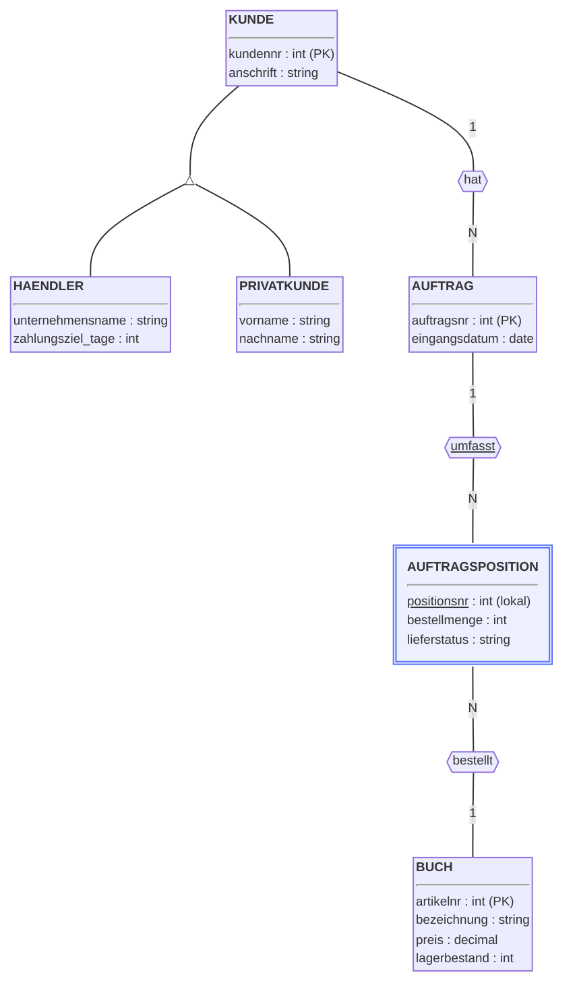

# Transformation ins Relationenmodell (20.10.2026)

---

## Übung: Transformation ins Relationenmodell

### Worum geht es?

Ihr habt gerade eben das ER-Modell für eLibri aufgestellt. In der
Praxisphase (Woche 4–6) habt ihr bereits gelernt, wie man ein
ER-Modell systematisch in ein Relationenmodell überführt — mit festen
Transformationsregeln für einzelne Entity-Typen, für Beziehungstypen
(1:N, N:M, 1:1, rekursiv), für abhängige Entity-Typen und für
Spezialisierung. Heute wendet ihr genau diese Regeln auf das eLibri-
Modell an, das ihr selbst gerade gebaut habt. Eine kurze Übersicht
aller Regeln findet ihr zum Nachschlagen auf der
[Termin-Übersichtsseite](index.md).

!!! abstract "Lernziele"
    - Ihr könnt nachvollziehen, wie ein vollständiges ER-Modell Schritt
      für Schritt und in der richtigen Reihenfolge in ein
      Relationenschema überführt wird.
    - Ihr könnt begründen, warum bei einer N:M-Beziehung eine eigene
      Relation entsteht, bei einer 1:N-Beziehung dagegen nicht.

### Kurzer Rückblick (ca. 7 Min.)

**1. Warum reicht das ER-Modell allein nicht aus, um eine Datenbank zu implementieren?**

<!-- MUSTERLOESUNG-START -->
??? tip "Antwort anzeigen"
    Dem ER-Modell fehlt eine Sprachkomponente, mit der man tatsächlich
    Daten abfragen oder ändern könnte. Deshalb hat sich zur
    Implementierung von Datenbanken das Relationenmodell durchgesetzt,
    ergänzt um die Datenbanksprache SQL.
<!-- MUSTERLOESUNG-ENDE -->

**2. Was unterscheidet die Transformation einer 1:N- von einer N:M-Beziehung?**

<!-- MUSTERLOESUNG-START -->
??? tip "Antwort anzeigen"
    Bei einer 1:N-Beziehung verschmilzt die Beziehung mit der Relation
    der N-Seite — ein einzelnes Fremdschlüsselattribut genügt. Bei
    einer N:M-Beziehung entsteht dagegen immer eine eigene, dritte
    Relation, weil ein einzelnes Fremdschlüsselattribut nicht
    gleichzeitig auf mehrere Datensätze verweisen kann.
<!-- MUSTERLOESUNG-ENDE -->

**3. Woraus setzt sich der Primärschlüssel einer Relation zusammen, die aus einem abhängigen Entity-Typ entsteht?**

<!-- MUSTERLOESUNG-START -->
??? tip "Antwort anzeigen"
    Aus dem lokalen Schlüsselattribut und dem Fremdschlüssel zum
    identifizierenden Entity-Typ zusammen — das lokale Attribut allein
    wäre nur innerhalb des identifizierenden Entity-Typs eindeutig,
    nicht über die gesamte Relation hinweg.
<!-- MUSTERLOESUNG-ENDE -->

**4. In welcher Reihenfolge transformiert man ein vollständiges ER-Diagramm am besten?**

<!-- MUSTERLOESUNG-START -->
??? tip "Antwort anzeigen"
    Zuerst Spezialisierungshierarchien, dann abhängige Entity-Typen,
    zuletzt die (normalen) Beziehungstypen — jeweils erst, nachdem die
    daran beteiligten Entity-Typen schon als Relation existieren.
<!-- MUSTERLOESUNG-ENDE -->

### Ausgangspunkt: Das eLibri-Modell aus der vorherigen Lehreinheit (ca. 3 Min.)

Das ist das Kern-Modell, das ihr gerade in der vorherigen Übung
aufgestellt habt — genau das transformiert ihr jetzt:

Wir gehen jetzt genau in der Reihenfolge vor, die ihr gerade in
Rückblick-Frage 4 hergeleitet habt: erst die Spezialisierung, dann die
einfachen Entity-Typen, dann der abhängige Entity-Typ, zuletzt die
1:N-Beziehungen.

### Spezialisierung transformieren (Regel 6) (ca. 8 Min.)

`KUNDE`, `HAENDLER` und `PRIVATKUNDE` werden nach Regel 6 zu drei
eigenen Relationen. Die beiden Subtyp-Relationen erhalten
`kundennr` als Fremdschlüssel — und weil pro Kunde höchstens ein
Datensatz in `HAENDLER` bzw. `PRIVATKUNDE` existieren darf, ist dieser
Fremdschlüssel gleichzeitig der Primärschlüssel der Subtyp-Relation.

<!-- MUSTERLOESUNG-START -->
**Relation `KUNDE`**

| Schlüssel | Attribut | Wertebereich | optional? |
|---|---|---|---|
| PK | kundennr | int | nein |
| – | anschrift | string | nein |

**Relation `HAENDLER`**

| Schlüssel | Attribut | Wertebereich | optional? |
|---|---|---|---|
| PK, FK | kundennr | int | nein |
| – | unternehmensname | string | nein |
| – | zahlungsziel_tage | int | nein |

**Relation `PRIVATKUNDE`**

| Schlüssel | Attribut | Wertebereich | optional? |
|---|---|---|---|
| PK, FK | kundennr | int | nein |
| – | vorname | string | nein |
| – | nachname | string | nein |

`FK` in `HAENDLER` bzw. `PRIVATKUNDE` referenziert jeweils `kundennr`
in `KUNDE`. Ein Kunde kann so höchstens einmal als Händler und
höchstens einmal als Privatkunde auftauchen, aber auch in keiner der
beiden Relationen vorkommen (laut eLibri-Szenario aber ausgeschlossen,
da jeder Kunde entweder Händler oder Privatkunde ist).
<!-- MUSTERLOESUNG-ENDE -->

### Einfache Entity-Typen transformieren (Regel 1) (ca. 5 Min.)

`AUFTRAG` und `BUCH` haben beide einen eigenen Schlüssel und keine
Besonderheiten — sie werden ganz normal nach Regel 1 transformiert.

<!-- MUSTERLOESUNG-START -->
**Relation `AUFTRAG`** (vorläufig, ohne Fremdschlüssel)

| Schlüssel | Attribut | Wertebereich | optional? |
|---|---|---|---|
| PK | auftragsnr | int | nein |
| – | eingangsdatum | date | nein |

**Relation `BUCH`**

| Schlüssel | Attribut | Wertebereich | optional? |
|---|---|---|---|
| PK | artikelnr | int | nein |
| – | bezeichnung | string | nein |
| – | preis | decimal | nein |
| – | lagerbestand | int | nein |

`AUFTRAG` bekommt seinen Fremdschlüssel zu `KUNDE` erst im
übernächsten Schritt (1:N-Beziehungen) — das ist Teil von Regel 3, nicht
von Regel 1.
<!-- MUSTERLOESUNG-ENDE -->

### Abhängigen Entity-Typ transformieren (Regel 5) (ca. 7 Min.)

`AUFTRAGSPOSITION` hat keinen eigenen Schlüssel — `positionsnr` ist nur
innerhalb eines Auftrags eindeutig. Nach Regel 5 verschmilzt
`AUFTRAGSPOSITION` mit der identifizierenden Beziehung `umfasst`.

<!-- MUSTERLOESUNG-START -->
**Relation `AUFTRAGSPOSITION`** (vorläufig, ohne Fremdschlüssel zu `BUCH`)

| Schlüssel | Attribut | Wertebereich | optional? |
|---|---|---|---|
| PK, FK | auftragsnr | int | nein |
| PK | positionsnr | int | nein |
| – | bestellmenge | int | nein |
| – | lieferstatus | string | nein |

Der Primärschlüssel setzt sich aus `positionsnr` (lokal) und dem
Fremdschlüssel `auftragsnr` (referenziert `AUFTRAG`) zusammen — erst
diese Kombination identifiziert eine Auftragsposition eindeutig, genau
wie beim Fertigungsauftrag-Beispiel aus Woche 6.
<!-- MUSTERLOESUNG-ENDE -->

### 1:N-Beziehungen einarbeiten (Regel 3) (ca. 8 Min.)

Jetzt sind alle beteiligten Entity-Typen bereits Relationen — die
beiden 1:N-Beziehungen können nach Regel 3 eingearbeitet werden:
`AUFTRAG` bekommt einen Fremdschlüssel zu `KUNDE` (Beziehung `hat`),
`AUFTRAGSPOSITION` zusätzlich einen Fremdschlüssel zu `BUCH`
(Beziehung `bestellt`).

<!-- MUSTERLOESUNG-START -->
**Relation `AUFTRAG`** (vollständig)

| Schlüssel | Attribut | Wertebereich | optional? |
|---|---|---|---|
| PK | auftragsnr | int | nein |
| FK | kundennr | int | nein |
| – | eingangsdatum | date | nein |

**Relation `AUFTRAGSPOSITION`** (vollständig)

| Schlüssel | Attribut | Wertebereich | optional? |
|---|---|---|---|
| PK, FK1 | auftragsnr | int | nein |
| PK | positionsnr | int | nein |
| FK2 | artikelnr | int | nein |
| – | bestellmenge | int | nein |
| – | lieferstatus | string | nein |

Beide neuen Fremdschlüssel sind **nicht optional**: Laut eLibri-
Szenario gehört jeder Auftrag zu genau einem Kunden, und jede
Auftragsposition bezieht sich auf genau ein Buch — beides
verpflichtende Teilnahmen.
<!-- MUSTERLOESUNG-ENDE -->

### Gesamtergebnis (ca. 5 Min.)

Das eLibri-Kern-Modell ist damit vollständig ins Relationenmodell
überführt und enthält sechs Relationen insgesamt.

<!-- MUSTERLOESUNG-START -->
Ein Hinweis zum Schluss: Nicht jede Information aus dem ER-Diagramm
bleibt bei der Transformation erhalten. Im ER-Modell musste jeder Auftrag mindestens
eine Auftragsposition haben — diese Untergrenze lässt sich im
Relationenmodell nicht erzwingen (Stichwort Erhaltung der
Informationskapazität, Woche 6). Ein Auftrag ganz ohne Position wäre
hier also möglich, obwohl das ER-Diagramm das eigentlich ausschließt.
<!-- MUSTERLOESUNG-ENDE -->

---

## Betreutes Selbststudium: Transformation ins Relationenmodell

### Worum geht es?

Ihr transformiert jetzt eigenständig (einzeln oder zu zweit) die
beiden Erweiterungen, die ihr selbst im betreuten Selbststudium zu
Block 01 modelliert habt: die Kreditkarte-Beziehung und die
Versandkopplung.

!!! abstract "Lernziele"
    - Ihr könnt selbstständig eine N:M-Beziehung nach Regel 2 in eine
      eigene Relation überführen.
    - Ihr könnt selbstständig eine rekursive M:N-Beziehung
      transformieren und dabei passende, rollenbasierte
      Fremdschlüsselnamen vergeben.
    - (Optional) Ihr könnt erklären, wie sich das
      Transformationsergebnis ändert, wenn sich die Kardinalität einer
      Beziehung ändert.

### Aufgabe 02: eLibri-Erweiterungen transformieren — Kreditkarte & Versandkopplung

??? info "Bezug zu Lehrinhalten"
    Regel 2 (N:M-Beziehungen) und die Besonderheit rekursiver
    Beziehungstypen: Praxisphase Woche 5, Abschnitt "N:M-Beziehungen"
    bzw. "Rekursive Beziehungen" (vgl. dort auch das `VERLAUF`-Beispiel
    zwischen Modulen). Eine Übersicht aller Regeln steht auf der
    [Termin-Übersichtsseite](index.md).

#### Teil A — Kreditkarte

> Aus Block 01: `KREDITKARTE` (Kartennummer als Schlüssel, Unternehmen,
> Ablaufdatum) ist über die N:M-Beziehung `nutzt` mit `PRIVATKUNDE`
> verbunden.

1. Transformiere `KREDITKARTE` nach Regel 1.
2. Transformiere die Beziehung `nutzt` nach Regel 2: Bilde die neue
   Relation (wähle einen sprechenden Namen) inkl. beider
   Fremdschlüssel und ihres gemeinsamen Primärschlüssels.

<!-- MUSTERLOESUNG-START -->
**Musterlösung Teil A:**

**Relation `KREDITKARTE`**

| Schlüssel | Attribut | Wertebereich | optional? |
|---|---|---|---|
| PK | kartennr | string | nein |
| – | unternehmen | string | nein |
| – | ablaufdatum | date | nein |

**Neue Relation `KARTENNUTZUNG`** (aus der Beziehung `nutzt`, Regel 2)

| Schlüssel | Attribut | Wertebereich | optional? |
|---|---|---|---|
| PK, FK1 | kundennr | int | nein |
| PK, FK2 | kartennr | string | nein |

`FK1` referenziert `PRIVATKUNDE` (nicht `KUNDE` oder `HAENDLER` — die
Beziehung galt ja nur für Privatkunden), `FK2` referenziert
`KREDITKARTE`. Da `nutzt` eine N:M-Beziehung ist, kann kein einzelnes
Fremdschlüsselattribut in einer der beiden bestehenden Relationen
genügen: Ein Privatkunde müsste sonst mehrere Kartennummern
gleichzeitig speichern können (und eine Karte mehrere Kundennummern)
— deshalb die eigenständige Relation `KARTENNUTZUNG`.
<!-- MUSTERLOESUNG-ENDE -->

#### Teil B — Versandkopplung

> Aus Block 01: Aufträge können über die rekursive M:N-Beziehung
> "versandt mit" auf `AUFTRAG` gekoppelt werden (Rollen: eigener
> Auftrag / mitversendeter Auftrag).

1. Transformiere diese rekursive Beziehung nach Regel 2. Wähle einen
   sprechenden Namen für die neue Relation.
2. Vergib für die beiden Fremdschlüssel passende, an den Rollen
   orientierte Namen — Achtung: Warum dürfen die beiden nicht einfach
   beide `auftragsnr` heißen?

<!-- MUSTERLOESUNG-START -->
**Musterlösung Teil B:**

**Neue Relation `VERSANDKOPPLUNG`** (aus der rekursiven Beziehung
"versandt mit", Regel 2)

| Schlüssel | Attribut | Wertebereich | optional? |
|---|---|---|---|
| PK, FK1 | auftragsnr_eigen | int | nein |
| PK, FK2 | auftragsnr_mitversendet | int | nein |

Beide Fremdschlüssel referenzieren `auftragsnr` in `AUFTRAG` — genau
wie beim `VERLAUF`-Beispiel aus Woche 5 müssen sie unterschiedliche
Namen tragen, sonst gäbe es in `VERSANDKOPPLUNG` zwei gleichnamige
Attribute und man könnte nicht mehr unterscheiden, welche Spalte für
welche Rolle steht.

Zusatzgedanke: Da die Beziehung symmetrisch ist (wird Auftrag A
zusammen mit B verschickt, gilt das auch umgekehrt), müsste man in der
Praxis entweder jede Kopplung als zwei Datensätze speichern (A,B) und
(B,A), oder man legt eine Konvention fest (z. B. immer die kleinere
Auftragsnummer in `auftragsnr_eigen`), um Duplikate zu vermeiden.
<!-- MUSTERLOESUNG-ENDE -->

#### Teil C — Was-wäre-wenn: Versandkopplung als 1:N statt M:N (optional)

*Nur, falls ihr mit Teil A und B schon fertig seid.*

> Stellt euch vor, eLibri würde die Versandkopplung einschränken:
> Jeder Auftrag könnte höchstens einem anderen, bereits existierenden
> "Sammel-Auftrag" zugeordnet werden — die Beziehung wäre dann nicht
> mehr M:N, sondern 1:N.

1. Transformiert diese vereinfachte Variante nach Regel 3 (rekursiver
   Fall).
2. Vergleicht: Warum genügt hier ein einzelnes Fremdschlüsselattribut,
   während Teil B eine eigene Relation brauchte?

<!-- MUSTERLOESUNG-START -->
**Musterlösung Teil C:**

**Relation `AUFTRAG`** (erweitert um den rekursiven Fremdschlüssel)

| Schlüssel | Attribut | Wertebereich | optional? |
|---|---|---|---|
| PK | auftragsnr | int | nein |
| FK | kundennr | int | nein |
| – | eingangsdatum | date | nein |
| FK | sammelauftragsnr | int | ja |

`sammelauftragsnr` referenziert `auftragsnr` derselben Relation
`AUFTRAG` (analog zum `ersatz_maschinennr`-Beispiel aus Woche 5) und
ist optional, da nicht jeder Auftrag laut Aufgabenstellung einem
Sammel-Auftrag zugeordnet sein muss.

Ein einzelnes Fremdschlüsselattribut genügt hier, weil jeder Auftrag
zu **höchstens einem** Sammel-Auftrag gehört (1:N) — bei Teil B konnte
dagegen ein Auftrag mit **beliebig vielen** anderen Aufträgen gekoppelt
sein (M:N), was ein einzelnes Attribut nicht abbilden kann. Der
Unterschied zwischen 1:N- und N:M-Transformation hängt also einzig an
der Kardinalität, nicht daran, ob die Beziehung rekursiv ist.
<!-- MUSTERLOESUNG-ENDE -->
